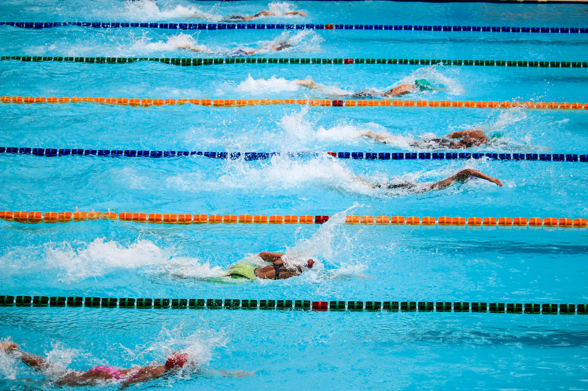
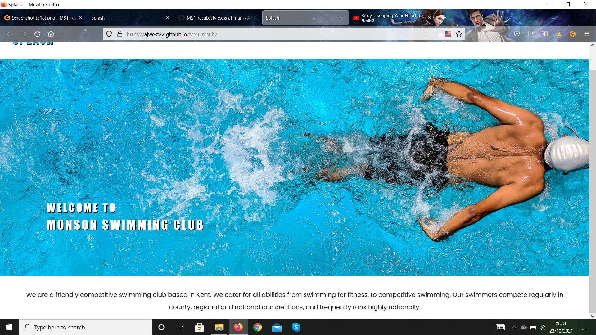
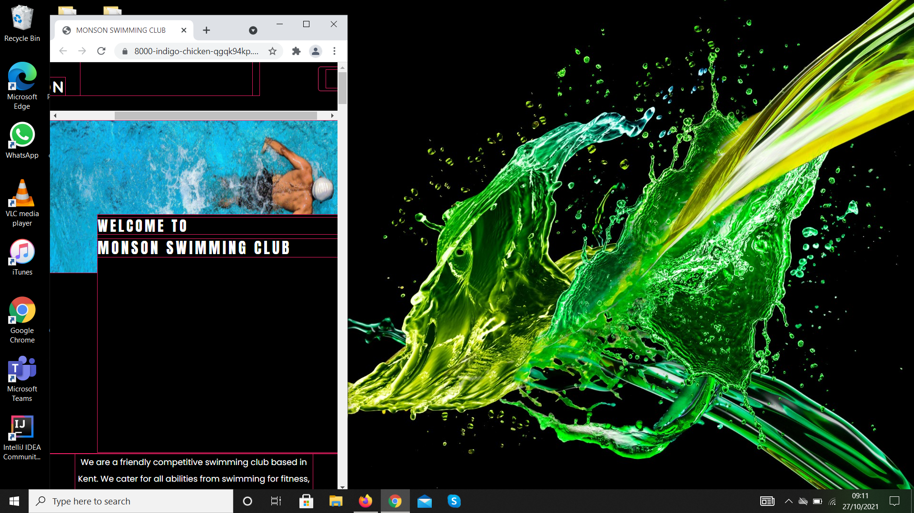
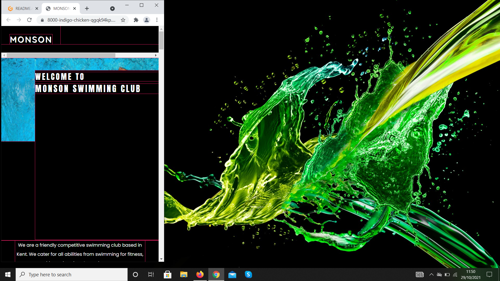
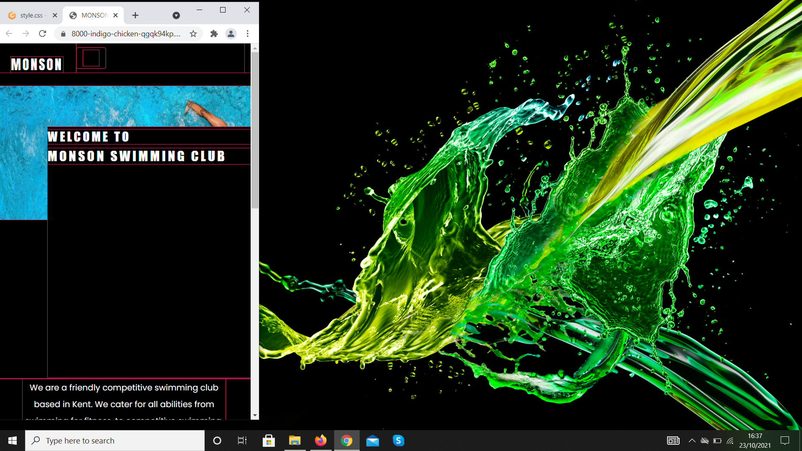
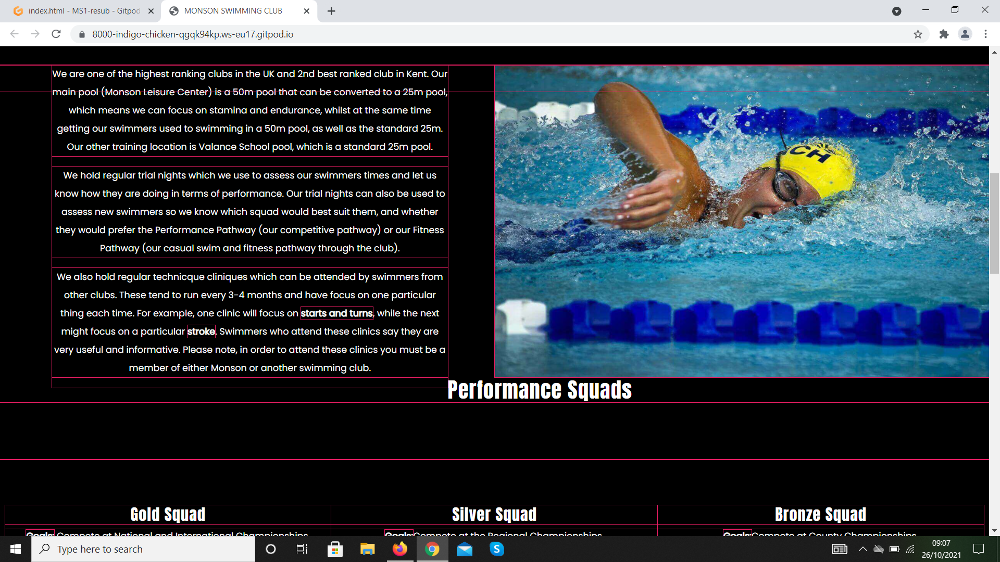

# MS1-resub

## Table of Contents

1. [Overview](#overview)

2. [Site Goals](#sitegoals)
    1. [UX Goals](#ux-goals)
    2. [Siteowners Goals](#siteowners-goals)
    3. [User Stories](#user-stories)
    4. [Siteowner Stories](#siteowner-stories)
    5. [Target Audience](#target-audience)

3. [About the Site](#about-the-site) 
    1. [Header Section](#header-section)
    2. [About Section](#about-section)
    3. [Squad Section](#squad-section)
    4. [Timetable Section](#timetable-section)
    5. [Contact Section](#contact-section)
    6. [Footer Section](#footer-section)

4. [Code Used](#code-used)
    1. [Frameworks](#frameworks)
  
5. [Design](#design)
    1. [Typography](#typography)
    2. [Colors](#colors)
    3. [Images](#images)

6. [Bugs](#bugs)

7. [Code Features](#code-features)
    1. [Logo](#logo)
    2. [Nav](#nav)
    3. [Toggle Mobile Menu](#toggle-mobile-menu)
    4. [Contact Form](#contact-form)
    5. [Social Media](#social-media)

8. [Features to be Added](#features-to-be-added)
    1. [Hover Effects](#hover-effects)
    2. [JavaScript](#javascript)
    3. [Gallery Page](#gallery-page)

9. [Testing](#testing)
    1. [HTML Validation](#html-validation)
    2. [CSS Validation](#css-validation)
    4. [Browser Compatibility](#browser-compatibility)
    5. [Devices Tested On](#devices-tested-on)

10. [Credits](#credits)
     1. [Icons](#icons)
     2. [Imagery](#imagery)
     3. [CSS Framework](#css-framework)

## Overview
  - This site was created for MS1 for Code Institute, and is a work of fiction. Any name or place that is used is made up, and any relation to
  any real places is entirely coincidental.
  - The site's name is "Monson Swimming Club"
  - The source code for this site can be found on GitHub [here](https://github.com/AJWest22/MS1-resub).
  - The purpose for this site is to advertise for a successful swimming club in an area called Monson, and entise people to learn to swim as well
  as try to draw already successful swimmers to a new club.

## **Site Goals**

### **UX Goals**

   - Users must be able to find out about the club
   - What type of swimmers the club caters for
   - How many hours the club offers
   - Users can contact the club owners for more information and with any questions they may have.

### **Siteowner's Goals**

   - Provide information on a swimming club, like its achievements, its ambitions, and timetables.
   - Ensure it is user friendly, and easy to use
   - Ensure the site leaves the user feeling positive after interacting with it

### **User Stories**

   - As a user I want to be able to see immediately the purpose of the site
   - As a user I want the site to be easy to navigate
   - As a user I want to be able to learn about the club in a structured manner
   - As a user I want to be able to easily find key information like training times
   - As a user I want a bit of site interaction with the owner, like a contact form for the site to feel official

### **Siteowner Stories**

  - As the siteowner I want a site that looks and feels good
  - As the siteowner I want a site that is responsive
  - As the siteowner I want the site to display the information in a easy to use way
  - As the siteowner I want the site to have some form of user interactivity.
  - As the siteowner the purpose of the site should be clear from the outset.

### **Target Audience**

  - Competitive swimmers looking to move to a more successful club
  - Competitive swimmers looking for more training hours
  - People looking to learn to swim
  - Ex-club swimmers looking to get back into swimmers
  - Teenagers wanting to swim for fitness

## About the Site

The site is one page divided into 6 sections: A header section, about section, squads section, timetable section, contact section, annd a footer with social media links.

### Header Section
The header section is the first section of the site and consists of a hero image with an animation, a welcome message on top of the hero image, and some intro text.

### About Section
The about section consists of some text about the club and an image. The image was found on pexels. The image and texts were aligned using fload right and float left respectively. The text is used to offer some information on the club, its achivements, and its training locations and pool size. The image is used to lift the site a bit and add a bit of interest to the section. 

### Squads Section
The squads section offers information on the squads the club offers, from its Gold Squad that consists of National swimmers to its Learn to Swim section. The squads use alternating background colors and text colors, blue on white, and white on blue. This adds a bit of interest to the site, and adds to the design of the site. The colors are also Monson Swimming Clubs chosen colors, so they are used to reinforce the club.

### Timetable Section
The timetable section contains the timetables of all the squads. They again use the same blue background and white text as some of the squad designs, this ensures there are no major design changes and it follows with the flow of the website. The timetable may sound too demanding and unrealistic, especially for the top squads, but this is standard for a lot of clubs in the UK. The timetables were orginally run togetheras one big block, however they were later divided into 4 timetables for the different squad groups, to keep it more manageable, readable and less overwhelming for the site user, especailly users viewing the site on mobile devices.

### Contact Section

This section is used to offer a bit of interactivity between the client and website owner. It gives a feeling of legitimacy and offers a sense of trust that this site is legit and the owner can be contacted with any questions on if they want mre information.

### Footer

The footer of the site contains their social media profiles. It is used as an alternative way of contacting the club, showing support for the club's achievemnts, and seeing what they have achieved at comeptetitions.

## Code Used

This site is written in HTML and CSS. HTML is used to provide the site's structure, such as the table element, and contact form, while CSS is used to add styling to the site, like the colouring of the site, and the sizing and positioning of images and text. Flexbox and CSS positioning are used to align items. Items that are two in a row, for example the about text and image, are aligned using the float positioning, whereas items of more than 2 in a row, for example the squads, are aligned using Flexbox. 

### Frameworks

Bootstrap is used to provide the collapsible menu on mobile. I used it as a way of providing the menu on mobile, without having to align the menu items vertivally on mobile in a straight line, as it adds a bit more style to the site.

## Design

The design of the site is a modern one, it draws on the use of whitespace between the text and images to create a modern look and feel, while still being easy to use. The site uses the club's main colours of blue (hexcodes #71bbd4 #62b4cf) to add style to the typography of the site, (the headers and the menu text for example) and lift the site against a white background.

### Typography

There are several fonts used in the site, Quicksand for the logo, Anton for the headers, and Poppins for the site text and menu links. I used Quicksand for the logo, with some letter spacing of 3px as it made the logo stand out, while keeping it simple, and not overtly showey or in your face, the spacing also allowed the letters some breathing space and along with the text-shadow of 1px, also helped making it stand out. The blue color is the same one to the rest of the site: #62b4cf, and set against the white background creates a nice contrast, while still making the site look clean and modern.

### Colors

The site's main colours are white and blue, as a reflection of the club's main colours. I chose these colours as they can create a nice contrast, and create a modern feel to the site. The colours used are: #62b4cf and #71bbd4. #71bbd4 is used solely for the menu, as a way of offering a slightly different shade to the logo and text, while still in keeping with the #62b4cf colour that is used in the headers and logo of the site. The white background is used to create whitespace, and a modern feel and look to the site. It also provides a nice contrast with the blue text, and when added with the black text-shadow in the texts, it creates an eyecatching look, for example in the squads section, the blue background and the white text of the Performance Squad section. 

### Images

There are four images used in the site, images are found on pexels and pixa bay (links to these images can be found in the credits section of this README) The images chosen aim to encourage people into swimming, and depict both training and competitive images. The header image:

is a training image of someone doing butterfly, the hardest stroke, which combined with the white welcome text, creates a sense of awe whie keeping the look modern and fresh. 

The second and fourth images are of a girl doing freestyle, typically regarded as the fastest of the 4 swimming strokes, and the most popular, this image is used to try to convey a sense of speed to demonstrate the club's competitive success, while creating a sense of familiarity, the stroke is instantly recognisable, this and the contact form next to the fourth image help to connect the site with the user and make the user feel less alienated from the site and make the site feel more welcoming, while still looking and feeling modern, and sticking with the site's colour scheme, for example the fourth image's blue background and the blue header text that introduces each section the image is found in. 

Second Image:

Fourth Image:

The third image in the fitness and Master's section is used to lift the site and keep the site looking modern in its look, while keping that section interesting and relevant to the overall site's purpose. The image  

depicts someone diving into the pool, this keeps the section relevant to the overall site content by introducing the fitness and Master's squads in a way that is inkeeping with the site's design, for example the alignment of the image and text and the typography used.

The fifth image in the footer:

is used to convey the club's experiences of competing, as in the footer is the club's social media which documents the club's successes in competitions, as well as offering another way to contact them. The contrast between the image and the white background and the shaded containers with the social media in, keeps the design fresh, while not deviating too much from the site's main design. This is demonstrated by the same typography used in the social media links: Poppins, and the footer header text: Anton, which is also the same colour as the other headers on the site, this also keeps the flow and feel of the site similar.

## Bugs

There are several bugs in this site which are documented below and the way they were attempted to be fixed: 

**Nav Bugs**

In the nav sometimes when you click on a link the site jumps but doesn't scroll for some reaosn. I have never had this happen before and unsure how to fix it completely. It does not happen all the time, but sometimes it can take clicking a nav link a couple of times for it to scroll to its correct place. I tried removing the nav links and reinserting them, but this didn't correct it. 

On mobile the toggle nav is off center, this is unusal as it was centering and working perfectly until the very late stages of development, again I'm not sure why this is, but attempts were made to correct this: overflow-y set to hidden and was used to stop the toggle button from dropping out of alignment with the logo, and overflow-x was set to hidden and was used in an attempt to keep the toggle menu button on the screen, closer to the logo, however although overflow-y stopped it from sinking out of alignment, overflow-x did little to correct the bug. On iPhone and Android Models in portrait mode, the menu was not visible at all, it was there but positioned off screen, this was demonstrated as when the phone was rotated to landscape mode, the menu appeared, and worked perfectly. In order for users to have a menu, it was decided to keep overflow-x turned off, so users could at least have a menu. 

Margin and padding were used to attempt to correct this, but setting the margin to margin-left and a negative figure, or margin-right to a positive figure, or doing the same ting but with padding-left and padding-right respectively corrected the bug. 

In the screenshots below you can see the nav centered on mobile in the beginning of development, and then later at the end it has been pushed out of container for some reason. This might be an issue with Flexbox and margins, as there is a similar issue with the Performance Squads text, as discussed later on.

Screenshot of nav centered in the early to late stages of development

  

Screenshot of the navbar on mobile prior to trying to fix it:
 (The navbar has moved from its original position out the container it is in)
  

Screenshot of the nav bar after some padding was added and overflow-x was added, it moved the nav closer to the logo, but out of alignment, and it still couldn't be seen on mobile despite no excess spacing showing up. Padding and margin were used to attempt to correct this but it wouldn't move.

  

Screenshots of the navbar on mobile in its current state, it is now in its original container, and aligned with the logo, padding-left with a negative setting and padding-right with a positive setting and margin-right with a positive setting were used to try to correct this, along with centering positions like align-content: center.

  
  

**Excess Spacing Bug**

On mobile there is some excess spacing below the header image and intro text. This is caused by the div with the welcome text in it, I've tried setting the height of the div, changing the size of the text, max height, changing padding, and margins but nothing has corrected it. I have attached screenshots of the excess spacing as shown by Chrome Developer tools showing where the excess spacing has come from. 

Screenshot of where excess sppacing has come from just below the hero image:

  

**Performance Squad Text Bug**

There were some difficulties centering the Performance Squad text on desktop, I tried centering it with, align-items, align-content, and text-align, but it will not move completely to the center. Margin and padding were also used, but the text was refusing the center. I have attached a screen grab of that section when viewed with the Chrome extension "Unicorn", and the text itself is out of its container, which is unusual as there is nothing in the HTML to suggest otherwise. There was an issue when using Flexbox to align the squads below the Performance Squad text jumped up and to the right (under the image with the is of #swimmer) which I think orginally caused this issue. Currently align-items: center is used to center everything, and although this works on mobile and tablet, it doesn't work on laptop and desktop. 

Originally there was a fitness squads header texr added to the site above the fitness squads as a way of introducing that section, but when it was added it jumped halfway up the page and again couldn't be centered, so was removed. This was probably due to the same reason as the above Performance Squad text. 

Screenshot of Performance Squads text can be seen out of its section:

  

**Uncentered about text on mobile**

The about text on mobile isn't centered, this is unusual as it is set to text-align: cnter, and centers on tablet and desktop. Margin and padding were used to try and correct this, but the text still couldn't be centered.

**Footer Text**

Instagram is not centered in its div in the footer, not sure why this is, it might be something to do with the padding in the #footer h2 in the css on desktop, but it is set to "text-align: center" in both, so should be centered. I have tried removing the padding, but this didn't work on centering it either. 

## Code Features

The code has several features worth noting: logo, nav, toggle mobile menu, contact form, social media

### Logo

  - Is used to help advertise the club
  - Quicksand font and letter-spacing is used to keep it simple, but also eye catching
  - Advertises the club's main colours

### Nav

  - is responsive
  - displays the sections of the website
  - uses a white background with blue text to give a modern look and feel
  - uses a similar blue text to the logo to keep the typography similar, while also being slightly different
  - Provides a way for users to naviagte the site
  - font family is the same as the rest of the font for text on the site (Poppins)

### Toggle Mobile Menu

  - acts as the mobile version of the site menu
  - has a blue background a similar shade as the club's logo to help keep the menu inkeeping with the rest of the site and club's colours.
  - the font is Poppins which is the same font the rest of the text on the site
  - Provides a way for users to navigate the site
  - Gives the site a modern look and feel

### Contact Form

   - offers a way of contacting the site owner
   - makes the site feel more reliable and trustworthy
   - same font family as rest of text on site (Poppins)
   - same background colour as club logo to keep the site flow the same
   - Submit button is a different shade of blue to the rest of the site to create a contrast between the light blue and the darker blue button colour. originally a white background was created with a lightblue text the same shade as the logo, but this wasn't possibe as the whole kept turning white, for some reason.
  
### Social Media

  - Located in the footer of the site
  - Offers an alternate way of contacting the club
  - A way of showing their success instead of just telling about them, so adds a sense that this is a good and reliable club
  - Offers a way of supporting them, even if you don't swim for them, by giving users the chance to follow them
  - Can be used as a way to show what sets are like by posting pictures of the sets done, and with permission, photos of the swimmers doing them

## Features to be Added

There were several features that I would have liked to have added but didn't have the time to complete. These include: hover effects for social media links, JavaScript for the form, gallery page, add more site pages.

### Hover Effects

At some point I would like to add hover colours for the social media links, that match that social media icon. So for exaple and light shade of blue for the twitter icon, a dark shade for the facebook icon, a light purple colour for the instagram icon, and red for the youtube and pinterest icons.

### JavaScript

I would like to add form validation with JavaScript to add some more realism to the contact form and the site as a whole. I'd also like to add in some JavaScript animations around the site.

### Gallery Page

At some point I'd like to add a gallery page with some more images, and style this using some javaScript animations and Flexbox layout

### Site Pages

I'd also like to add more site pages, right now the site is one page with a lot of content. So at some point I'd like to restructure the site, with more pages and submenus, so have a menu link for "Squads" with a sub menu with links to pages on the Performance Squads, Development Squads, Academy, and Fitness and Master's Squads pages. I'd also like to create a seperate page for the contact form, and timetables as information would be spread out nicer and easier to access.

https://images.pexels.com/photos/863988/pexels-photo-863988.jpeg?auto=compress&cs=tinysrgb&dpr=2&h=750&w=1260